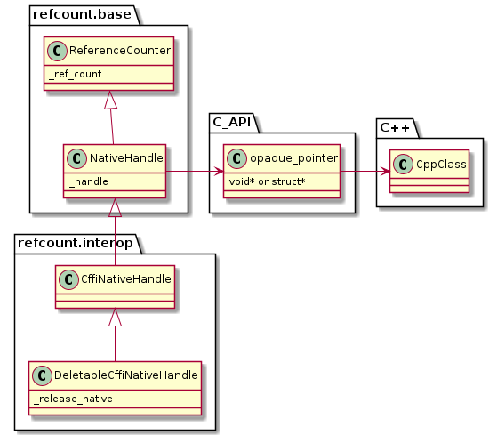

# refcount documentation

> Python classes for reference counting

[](https://github.com/csiro-hydroinformatics/pyrefcount/blob/master/LICENSE.txt)  [](https://pyrefcount.readthedocs.io/en/latest/?badge=latest) [](https://codecov.io/gh/csiro-hydroinformatics/pyrefcount) master: [](https://ci.appveyor.com/project/jmp75/pyrefcount/branch/master) testing: [](https://ci.appveyor.com/project/jmp75/pyrefcount/branch/testing)



This package is primarily for managing resources in native libraries, written for instance in C++, from Python. While it boils down to "simply" maintaining a set of counters, **it is deceptively complicated to do so properly** and not end up with memory leaks or crashes. This package offers structured options for reliably managing external native resources. Surprisingly I could not locate an existing package doing just what I needed. Other use cases requiring reference counting, aside from native library resources, may benefit from reusing and extending classes in `refcount`.

`refcount` ( >=0.7) includes classes using [cffi](https://cffi.readthedocs.io/). Other low-level interoperability mechanisms may well be added in the future.

## License

MIT (see [License.txt](https://github.com/csiro-hydroinformatics/pyrefcount/blob/master/LICENSE.txt))

## Source code

The code repository is on [GitHub](https://github.com/csiro-hydroinformatics/pyrefcount).

## Installation

### conda-forge

Using `conda` or `mamba`:

```sh
mamba install -c conda-forge refcount
```

### pypi

```sh
pip install refcount
```

### From source (development)

```sh
pip install -r requirements.txt
pip install -e .
```


## Sample use

The following example is based on one of the unit tests. 

Say we have a C++ library with objects and a C API:

```C++
#define TEST_DOG_PTR  testnative::dog*
#define TEST_OWNER_PTR  testnative::owner*
#define TEST_COUNTED_PTR  testnative::reference_counter*

testnative::dog* create_dog();
testnative::owner* create_owner(testnative::dog* d);
void say_walk(testnative::owner* owner);
void release(testnative::reference_counter* obj);
// etc.
```

From the outside of the library the API is exported with opaque pointers `void*` (C structs pointers and native C99 types could be handled too).

```C++
void* create_dog();
void* create_owner(void* d);
void say_walk(void* owner);
void release(void* obj);
// etc.
```

Starting with the end in mind, from Python we want an API hiding the low level details close to the C API, in particular avoiding managing native memory via `release` C API calls, piggybacking the python GC instead.

```py
dog = Dog()
owner = DogOwner(dog)
owner.say_walk()
print(dog.position)
dog = None # the "native dog" is still alive though, as the owner incremented the ref count
owner = None
```

This is doable with `refcount` and the `cffi` package. One possible design is:

```py
ut_ffi = cffi.FFI()

ut_ffi.cdef('extern void* create_dog();')
ut_ffi.cdef('extern void* create_owner( void* d);')
ut_ffi.cdef('extern void say_walk( void* owner);')
ut_ffi.cdef('extern void release( void* obj);')
# etc.

ut_dll = ut_ffi.dlopen('c:/path/to/test_native_library.dll', 1) # Lazy loading

class CustomCffiNativeHandle(CffiNativeHandle):
    def __init__(self, pointer, prior_ref_count = 0):
        super(CustomCffiNativeHandle, self).__init__(pointer, type_id='', prior_ref_count = prior_ref_count)

    def _release_handle(self) -> bool:
        ut_dll.release(self.get_handle())
        return True

class Dog(CustomCffiNativeHandle):
    def __init__(self, pointer = None):
        if pointer is None:
            pointer = ut_dll.create_dog()
        super(Dog, self).__init__(pointer)
    # etc.

class DogOwner(CustomCffiNativeHandle):

    def __init__(self, dog):
        super(DogOwner, self).__init__(None)
        self._set_handle(ut_dll.create_owner(dog.get_handle()))
        self.dog = dog
        self.dog.add_ref() # Do note this important reference increment

    def say_walk(self):
        ut_dll.say_walk(self.get_handle())

    def _release_handle(self) -> bool:
        super(DogOwner, self)._release_handle()
        # super(DogOwner, self)._release_handle()
        self.dog.release()
        return True
```

## Related work

### Ancestry, acknowledgements

This python package `refcount` actually spawned from prior work for interoperability between C++, R and .NET ([R.NET](https://github.com/rdotnet/rdotnet))

`refcount` features using `cffi` were also significantly informed by Kevin Plastow's [work](https://search.informit.com.au/documentSummary;dn=823898220073899;res=IELENG) while he was at the Australian Bureau of Meteorology; this contribution is gratefully acknowledged.

In you have native interop needs you may also want to look at:

* the nuget package [dynamic-interop-dll](https://github.com/rdotnet/dynamic-interop-dll) for .NET/native interop.
* a set of mostly c++ software [tools for interop with C/C++](https://github.com/csiro-hydroinformatics/rcpp-interop-commons)
* a C# library for [generating interop glue code on top of C API glue code](https://github.com/csiro-hydroinformatics/c-api-wrapper-generation).

### Other python packages

`refcount` was created in part because no existing prior (Python) work could quite fit the need. There are however packages that may better address your particular need:

* [infi.pyutils](https://pypi.org/project/infi.pyutils/) contains a reference counting class.
